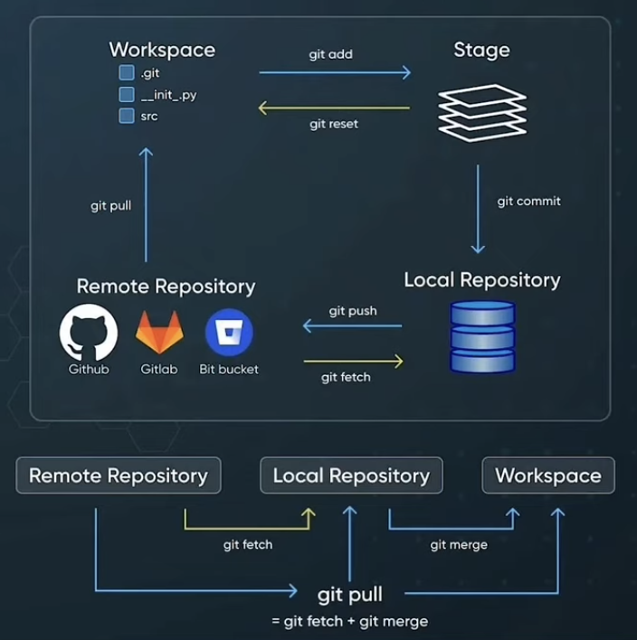

# Git : A Complete Guide

Welcome to the world of Git! This guide will walk you through the fundamental concepts and operations of Git, a powerful version control system essential for modern software development.

## Understanding Git's Core Concepts

Git, at its heart, is a system that meticulously **tracks changes** made to your project's files **over time**. Instead of just saving different versions of your entire project, Git cleverly records the *differences* between each version. This makes it incredibly efficient in terms of storage space.

Think of it as a **time machine for your projects**, allowing you to go back to any previous state. Imagine you made a change that introduced a bug, or you want to see how a particular piece of code looked a month ago. With Git, you can easily travel back in time to any recorded point in your project's history.

Here's a breakdown of what this means:

* **Snapshots of Your Project:** Git doesn't just track changes line by line. Instead, it takes **snapshots** of your entire project at specific points in time. These snapshots are called **commits**. Each commit captures the state of all your files and directories at that moment.

* **A Detailed History:** Every time you make a commit, Git records it, along with information like who made the changes, when, and why (through the commit message). This creates a chronological **history** of your project's evolution.

* **Reverting to Previous States:** Because Git keeps track of these snapshots, you can easily **revert** your project back to any previous commit. This is incredibly useful if you make a mistake or want to discard a set of changes.

* **Comparing Changes:** Git allows you to **compare** different versions of your files or even your entire project. This helps you understand exactly what changes were made between different commits or branches.

* **Collaboration Made Easy:** This ability to track changes and revert to previous states is fundamental for **collaboration**. Multiple developers can work on the same project simultaneously, making changes independently, and Git provides tools to manage and integrate those changes seamlessly.

In essence, Git provides a robust and efficient way to manage the history of your code, enabling you to understand, control, and collaborate on your projects effectively. It's more than just a backup system; it's a powerful tool for managing the entire lifecycle of your software development.

### The .git Directory and Object Database

When you initialize a Git repository (using `git init`), Git creates a hidden directory named `.git` in your project's root. This directory is the brain of Git, containing all the history and configuration of your repository.

Inside `.git`, there's a crucial subdirectory called `objects`. This is Git's **object database**, where it stores every version of every file, as well as metadata about the history of your project.

#### File Store Object in Object Database

Git doesn't just store files as you see them in your file system. Instead, it stores them as **objects** within this database. Each object is uniquely identified by a **SHA1 hash** of its content.

#### Object Types: Commits, Trees, Blobs

There are three main types of objects Git uses:

* **Blobs:** A **blob** represents the content of a file at a specific point in time. It doesn't contain any metadata like the filename or permissions. It's just the raw data.

* **Trees:** A **tree** object represents a directory. It doesn't contain the actual file content but rather lists the blobs and other trees (subdirectories) contained within that directory, along with their names and permissions. **This solves the problem of not having the file name associated with the blob.** You can think of a tree as a directory in your file system.

* **Commits:** A **commit** is a snapshot of your entire project at a specific point in time. It points to a top-level tree object representing the root directory of your project. It also contains metadata like the author, committer, commit message, and pointers to the parent commit(s), forming a history.

#### A Blob represents file contents without metadata

As mentioned above, a blob is purely the content of a file. If you have the same content in two different files, Git will store that content only once as a single blob.

#### A tree represents a directory

A tree object organizes blobs and other trees into a hierarchical structure, effectively representing the directory structure of your project at a specific commit.

#### A Commit is a snapshot of the project

A commit ties everything together. It represents a specific state of your project, pointing to a tree that represents the root directory and containing essential metadata.

#### Commits Ids are SHA1 hashes

Every object in Git (blobs, trees, and commits) is uniquely identified by a 40-character **SHA1 hash**. This hash is calculated based on the content of the object. This ensures that if even a single bit changes in a file, the resulting blob and consequently the commit will have a completely different ID.

#### A branch is a reference to a commit ID

A **branch** in Git is simply a lightweight, movable pointer to a specific commit. When you create a new branch, you're essentially creating a new reference that points to the same commit you're currently on. As you make new commits on that branch, the branch pointer moves forward to the latest commit.

#### Tree solves the problems of not having the file name associated with the blob you can think of a tree as a directory in the file system.

This highlights the crucial role of the tree object. Without it, Git would just have a collection of file contents (blobs) without any context of how they were organized into directories and what their names were. The tree object provides this essential organizational structure.

#### Folder structure .git/objects/ie

To efficiently manage a large number of objects, Git doesn't store all object files directly under the `objects` directory. Instead, it uses a two-level directory structure. The first two characters of the SHA1 hash become the name of a subdirectory, and the remaining 38 characters become the name of the object file within that subdirectory (i.e., `.git/objects/c6/12f...`). This helps Git avoid having too many files in a single directory, which can impact performance.

#### Git Stores data

Git stores data in a way that prioritizes integrity and efficiency. By using SHA1 hashes, Git can ensure that the content of an object has not been tampered with.

#### Content Addressable system where we can store any type of data in key value where Key is SHA1

Git is often described as a **content-addressable file system**. This means that each piece of data is addressed (identified) by its content (specifically, its SHA1 hash). This allows Git to efficiently store and retrieve data and also ensures data integrity. The SHA1 hash acts as the **key**, and the object (blob, tree, or commit) is the **value**.

## Understanding Git's Working Areas

Git organizes your work into three main areas:

* **Workspace (Working Directory):** This is where you have the actual files of your project as you see them in your file system. You can edit, add, and delete files here.

* **Staging Area (Index):** The staging area is a temporary holding place for changes you intend to commit. Before you commit your changes to the local repository, you first add them to the staging area using the `git add` command. Think of it as preparing a list of changes you want to include in your next snapshot.

* **Local Repository (.git directory):** This is where Git stores the history of your project as a series of commits. When you run `git commit`, the changes in the staging area are permanently recorded in the local repository as a new commit object.

* **Remote Repository:** A remote repository is a version of your project that is hosted on a server, often used for collaboration and backup. Platforms like GitHub, GitLab, and Bitbucket provide hosting for remote Git repositories. You can push changes from your local repository to the remote repository and pull changes from the remote repository to your local repository.





## Common Git Operations

Here are some fundamental Git operations you'll use frequently:

* **`git init`:** Initializes a new Git repository in the current directory.
* **`git clone <remote_url>`:** Creates a copy of a remote repository on your local machine.
* **`git add <file(s)>`:** Adds changes from your workspace to the staging area. Use `git add .` to stage all changes.
* **`git commit -m "Your commit message"`:** Records the changes in the staging area to your local repository, creating a new commit with the provided message.
* **`git status`:** Shows the current state of your workspace and staging area.
* **`git log`:** Displays the history of commits in your repository.
* **`git branch`:** Lists your branches. Use `git branch <branch_name>` to create a new branch.
* **`git checkout <branch_name>`:** Switches to the specified branch. Use `git checkout -b <new_branch_name>` to create and switch to a new branch.
* **`git push <remote_name> <branch_name>`:** Sends your local commits to a remote repository. `origin` is a common name for the main remote repository.
* **`git pull <remote_name> <branch_name>`:** Fetches changes from a remote repository and merges them into your current branch.
* **`git fetch <remote_name>`:** Downloads commits and objects from the remote repository without trying to merge them into your local branches.

### Git Merge

`git merge` is used to combine the changes from one branch into another. Typically, you would merge a feature branch back into your main branch (e.g., `main` or `master`).

```bash
git checkout main
git merge feature-branch
```

[Watch git merge](assets/git-merge-animation.mp4)
<video id="myVideo" controls width="640" height="360"  autoplay loop controls>
  <source src="assets/git-merge-animation.mp4" type="video/mp4">
  <source src="assets/git-merge-animation.gif" type="video/webm">
  Your browser does not support the video tag.
</video>

### Git Rebase

`git rebase` is another powerful way to integrate changes from one branch into another. Unlike `git merge`, which creates a new "merge commit" to combine histories, `git rebase` moves the entire commit history of the source branch onto the tip of the target branch. This results in a linear and often cleaner commit history.

A common use case is to rebase a feature branch onto the `main` (or `master`) branch before merging. This helps to keep the `main` branch history tidy and easier to follow.

Here's a basic example:

```bash
git checkout feature-branch
git rebase main
```

[Watch git rebase](assets/git-rebase-animation.mp4)
<video id="myVideo" controls width="640" height="360"  autoplay loop controls>
  <source src="assets/git-rebase-animation.mp4" type="video/mp4">
  <source src="assets/git-rebase-animation.gif" type="video/webm">
  Your browser does not support the video tag.
</video>

### Git Squash Commit (via Interactive Rebase)

**Squashing commits** is the process of combining multiple commits into a single, more meaningful commit. This is often done to clean up the commit history of a feature branch before merging it into a main branch. Instead of having a series of small, incremental commits like "Fix typo," "Add missing function," and "Refactor logic," you can squash them into a single commit that represents the complete feature addition or bug fix.

The most common way to squash commits is by using **interactive rebase**. Here's how it works:

```bash
git checkout <your_feature_branch>
git rebase -i <base_branch>
```

[Watch squash commit](assets/squash-commit-animation.mp4)
<video id="myVideo" controls width="640" height="360"  autoplay loop controls>
  <source src="assets/squash-commit-animation.mp4" type="video/mp4">
  <source src="assets/squash-commit-animation.gif" type="video/webm">
  Your browser does not support the video tag.
</video>